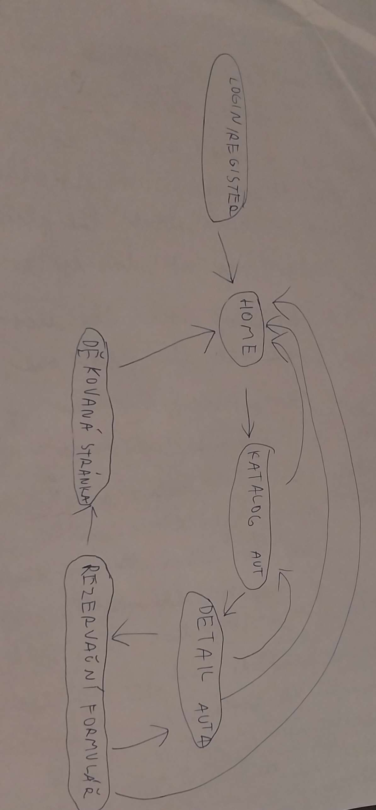
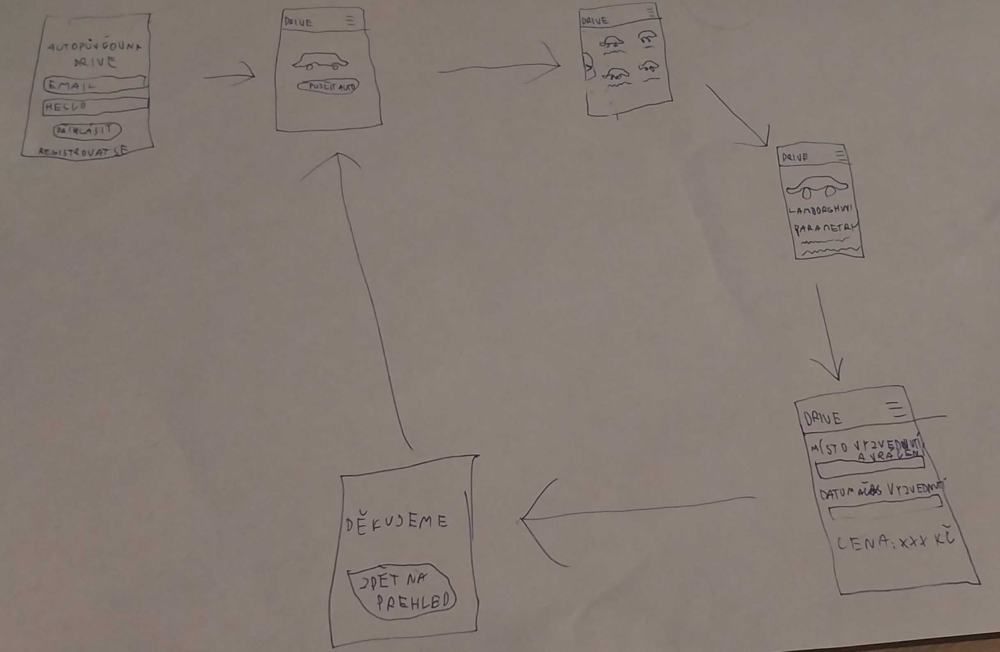
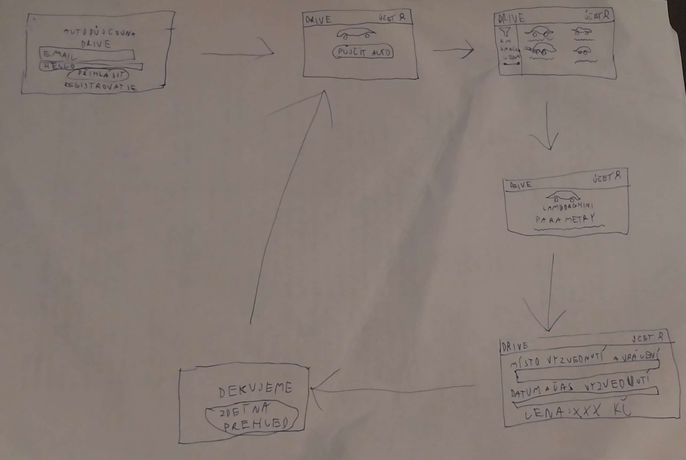
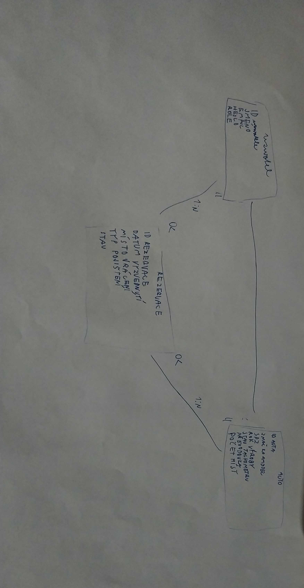

# Autopůjčovna Drive – Databáze vozidel a správa rezervací 
Projekt Autopůjčovna Drive je webová aplikace zaměřená na pronájem vozidel a správu vozového parku. Hlavním cílem aplikace je umožnit zákazníkům vyhledávat automobily podle jejich preferencí a provádět online rezervace na konkrétní časový úsek.
V systému vystupují dvě základní role: anonymní návštěvník, registrovaný uživatel.
Anonymní návštěvník může zobrazovat základní informace o půjčovně, prohlížet si katalog aut bez schopnosti rezervace nebo hodnocení a vytvořit si uživatelský účet. Po registraci získá uživatel přístup ke svému profilu a k hlavní stránce aplikace. Na této stránce se zobrazují informace o aktuálních výpůjčkách, historie objednávek, seznam oblíbených vozů a možnost vytvořit novou rezervaci z databáze.
Každé auto je v aplikaci uloženo jako samostatný záznam, který obsahuje značku, model, registrační značku, rok výroby, stav tachometru a typ převodovky, druh paliva, počet míst, objem kufru a výkon motoru. 
Uživatel tak může pomocí vyhledávání rychle najít požadovaný vůz a přidat jej do svého seznamu rezervací. Při vytváření nové rezervace může uživatel zadat datum vyzvednutí, místo vrácení a vybrané pojištění.

